# chapter9-learnCVPR2019-Context-Aware_Crowd_Counting

This is an simple and clean unoffical implemention https://github.com/CommissarMa/Context-Aware_Crowd_Counting-pytorch of CVPR 2019 paper ["Context-Aware Crowd Counting"](https://arxiv.org/pdf/1811.10452.pdf).

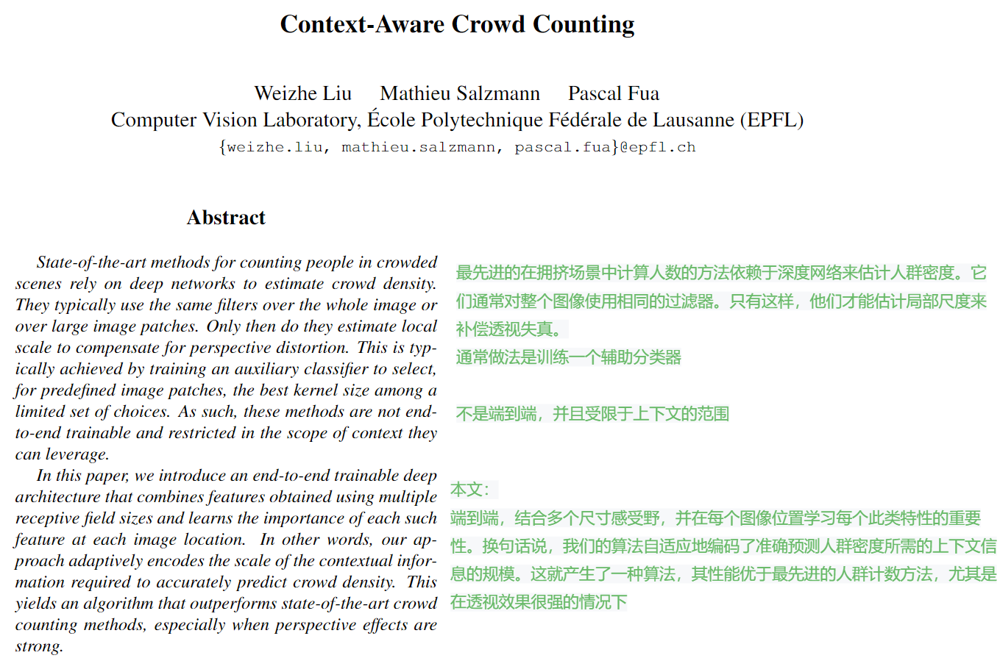

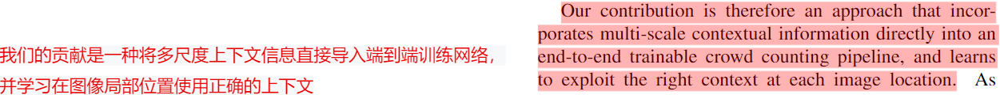

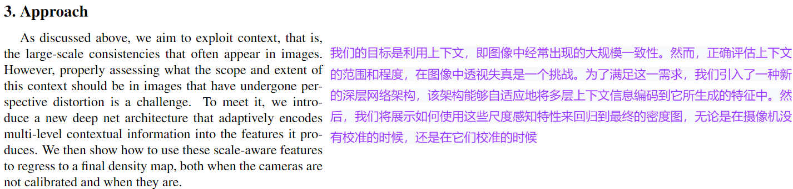

------

- This is my visualized model structure

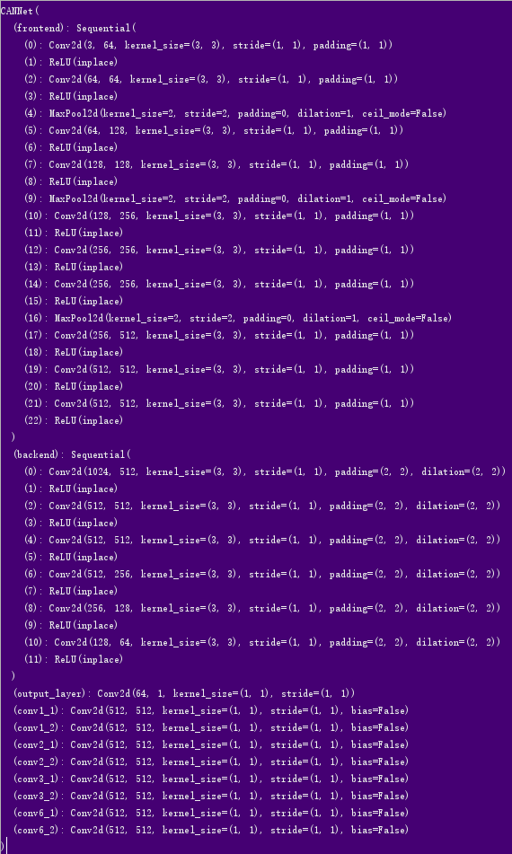

- This is the diagram of the network structure in the paper

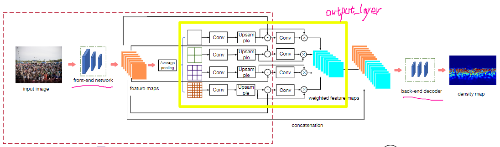

**Next, I will explain the network architecture of this paper in the form of code**

------

## Testing

```
super(CANNet,self).__init__()  #self: CANNet    load_weights: False
self.frontend_feat=[64, 64, 'M', 128, 128, 'M', 256, 256, 256, 'M', 512, 512, 512]  # frontend_feat: class 'list'>
self.frontend = make_layers(self.frontend_feat)  #跳转到下面def make_layers，得到图1结果
```

and

```
def make_layers(cfg, in_channels = 3,batch_norm=False,dilation = False): # cfg: <class 'list'>: [64, 64, 'M', 128, 128, 'M', 256, 256, 256, 'M', 512, 512, 512]   in_channels = 3,batch_norm=False,dilation = False,  跳转到 else：d_rate = 1
    if dilation:
        d_rate = 2
    else:
        d_rate = 1
    layers = []   #<class 'list'> ： [ ]
    for v in cfg:    # 依次遍历cfg的list     举个例子：v=64  得到<layer：class 'list'>: [Conv2d(3, 64, kernel_size=(3, 3), stride=(1, 1), padding=(1, 1)), ReLU(inplace)]
        if v == 'M':
            layers += [nn.MaxPool2d(kernel_size=2, stride=2)]
        else:
            conv2d = nn.Conv2d(in_channels, v, kernel_size=3, padding=d_rate,dilation = d_rate)  #conv2d：Conv2d(3,64,kernel_size=(3,3),stride=(1,1),padding=(1,1))
            if batch_norm:
                layers += [conv2d, nn.BatchNorm2d(v), nn.ReLU(inplace=True)]
            else:
                layers += [conv2d, nn.ReLU(inplace=True)]
            in_channels = v
    return nn.Sequential(*layers)  #整个遍历完得到图1
```

you will get：

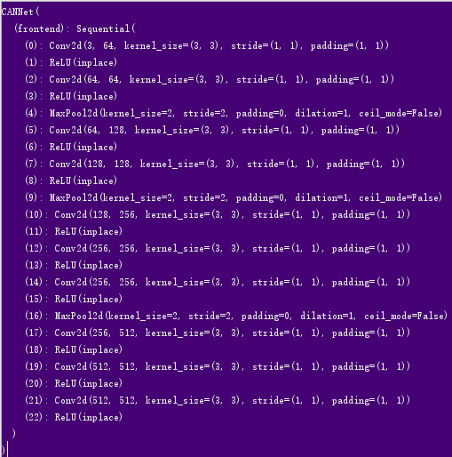

- In fact, this is the first 10 layers of VGGNet

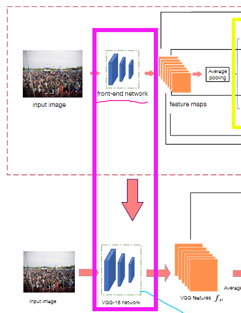

- It's described in the paper：

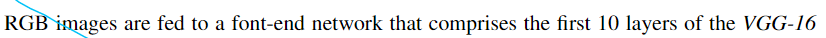

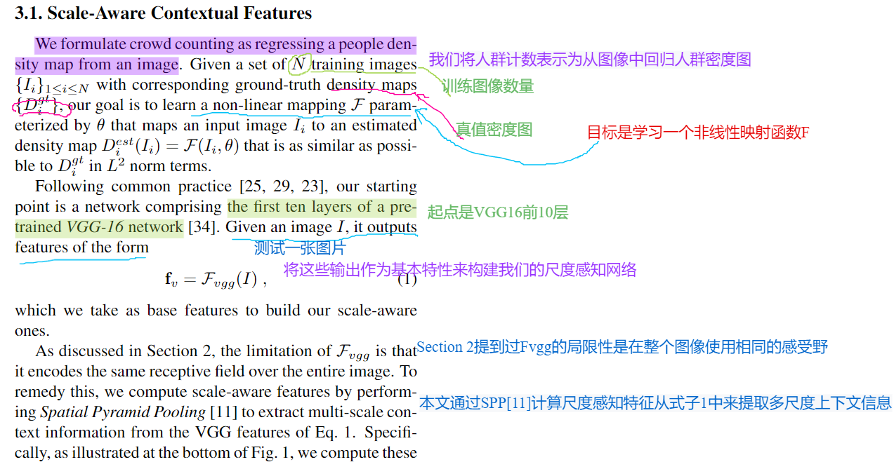


```
self.backend_feat=[512, 512, 512,256,128,64]     # backend_feat: <class 'list'>
```

and

```
self.backend = make_layers(self.backend_feat,in_channels = 1024,dilation = True) #跳转到下面def make_layers的dilation = True
```

and

```
def make_layers(cfg, in_channels = 3,batch_norm=False,dilation = False): # cfg: <class 'list'>: [64, 64, 'M', 128, 128, 'M', 256, 256, 256, 'M', 512, 512, 512]   in_channels = 3,batch_norm=False,dilation = False,  跳转到 else：d_rate = 1
    if dilation:
        d_rate = 2
    else:
        d_rate = 1
    layers = []   #<class 'list'> ： [ ]
    for v in cfg:    # 依次遍历cfg的list     举个例子：v=64  得到<layer：class 'list'>: [Conv2d(3, 64, kernel_size=(3, 3), stride=(1, 1), padding=(1, 1)), ReLU(inplace)]
        if v == 'M':
            layers += [nn.MaxPool2d(kernel_size=2, stride=2)]
        else:
            conv2d = nn.Conv2d(in_channels, v, kernel_size=3, padding=d_rate,dilation = d_rate)  #conv2d：Conv2d(3,64,kernel_size=(3,3),stride=(1,1),padding=(1,1))
            if batch_norm:
                layers += [conv2d, nn.BatchNorm2d(v), nn.ReLU(inplace=True)]
            else:
                layers += [conv2d, nn.ReLU(inplace=True)]
            in_channels = v
    return nn.Sequential(*layers) 
```

you will get：

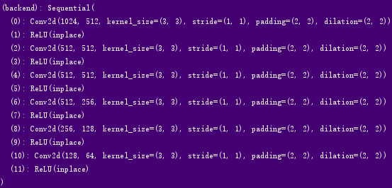

that is ：

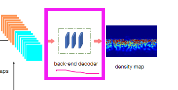

It's described in the paper：

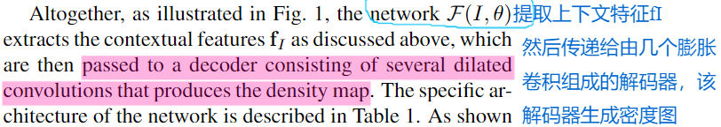

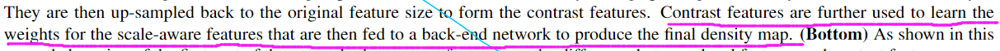


```
self.output_layer = nn.Conv2d(64, 1, kernel_size=1)  #得到图3
        self.conv1_1=nn.Conv2d(512,512,kernel_size=1,bias=False)
        self.conv1_2=nn.Conv2d(512,512,kernel_size=1,bias=False)
        self.conv2_1=nn.Conv2d(512,512,kernel_size=1,bias=False)
        self.conv2_2=nn.Conv2d(512,512,kernel_size=1,bias=False)
        self.conv3_1=nn.Conv2d(512,512,kernel_size=1,bias=False)
        self.conv3_2=nn.Conv2d(512,512,kernel_size=1,bias=False)
        self.conv6_1=nn.Conv2d(512,512,kernel_size=1,bias=False)
        self.conv6_2=nn.Conv2d(512,512,kernel_size=1,bias=False) 
```

you will get 

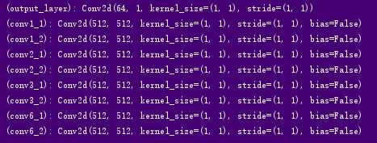

It is implemented as follows：

```
    def forward(self,x):
        fv = self.frontend(x)
        #S=1
        ave1=nn.functional.adaptive_avg_pool2d(fv,(1,1))
        ave1=self.conv1_1(ave1)
#        ave1=nn.functional.relu(ave1)
        s1=nn.functional.upsample(ave1,size=(fv.shape[2],fv.shape[3]),mode='bilinear')
        c1=s1-fv
        w1=self.conv1_2(c1)
        w1=nn.functional.sigmoid(w1)
        #S=2
        ave2=nn.functional.adaptive_avg_pool2d(fv,(2,2))
        ave2=self.conv2_1(ave2)
#        ave2=nn.functional.relu(ave2)
        s2=nn.functional.upsample(ave2,size=(fv.shape[2],fv.shape[3]),mode='bilinear')
        c2=s2-fv
        w2=self.conv2_2(c2)
        w2=nn.functional.sigmoid(w2)
        #S=3
        ave3=nn.functional.adaptive_avg_pool2d(fv,(3,3))
        ave3=self.conv3_1(ave3)
#        ave3=nn.functional.relu(ave3)
        s3=nn.functional.upsample(ave3,size=(fv.shape[2],fv.shape[3]),mode='bilinear')
        c3=s3-fv
        w3=self.conv3_2(c3)
        w3=nn.functional.sigmoid(w3)
        #S=6
#        print('fv',fv.mean())
        ave6=nn.functional.adaptive_avg_pool2d(fv,(6,6))
#        print('ave6',ave6.mean())
        ave6=self.conv6_1(ave6)
#        print(ave6.mean())
#        ave6=nn.functional.relu(ave6)
        s6=nn.functional.upsample(ave6,size=(fv.shape[2],fv.shape[3]),mode='bilinear')
#        print('s6',s6.mean(),'s1',s1.mean(),'s2',s2.mean(),'s3',s3.mean())
        c6=s6-fv
#        print('c6',c6.mean())
        w6=self.conv6_2(c6)
        w6=nn.functional.sigmoid(w6)
#        print('w6',w6.mean())
        
        fi=(w1*s1+w2*s2+w3*s3+w6*s6)/(w1+w2+w3+w6+0.000000000001)
#        print('fi',fi.mean())
#        fi=fv
        x=torch.cat((fv,fi),1)
        
        x = self.backend(x)
        x = self.output_layer(x)
        return x
```

that is ：

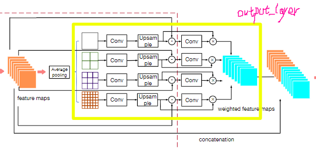

It's described in the paper：

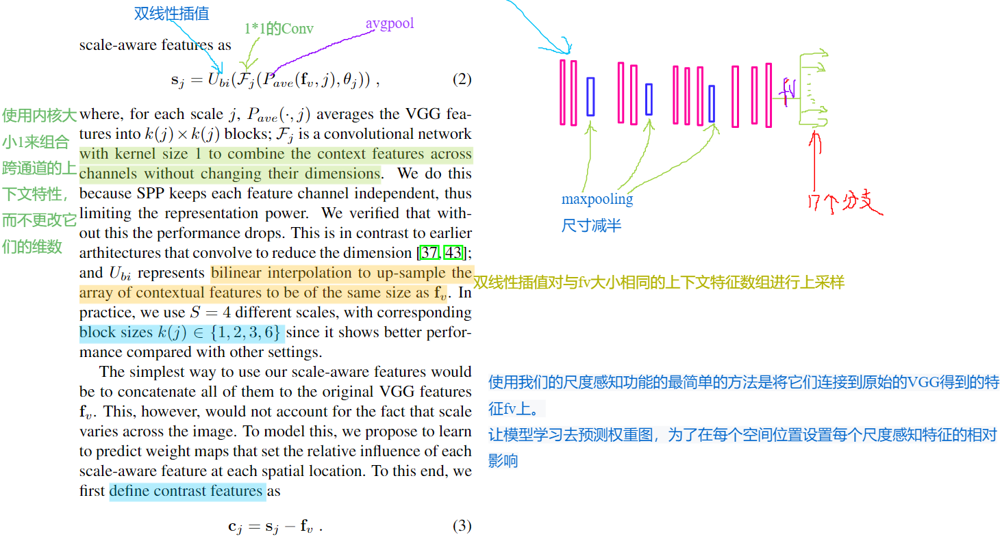

and

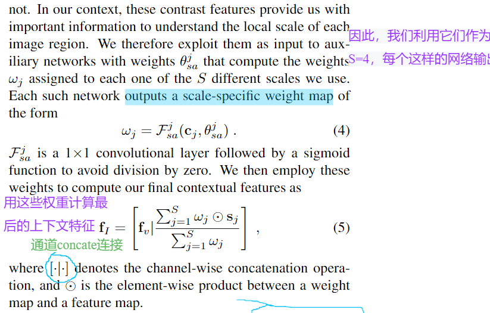


Then

```
    with torch.no_grad():
        for i,(img,gt_dmap) in enumerate(tqdm(dataloader)):  # 先跳转到my_dataset.py中的def __len__(self)
            img=img.to(device)  # torch.Size([1, 3, 704, 1024])
            gt_dmap=gt_dmap.to(device)  #torch.Size([1, 1, 88, 128])
            # forward propagation
            et_dmap=model(img)  #跳转到cannet中的def forward
            mae+=abs(et_dmap.data.sum()-gt_dmap.data.sum()).item()
            del img,gt_dmap,et_dmap

    print("model_param_path:"+model_param_path+" mae:"+str(mae/len(dataloader)))
```

- Finally, you will get the results of **mae**

  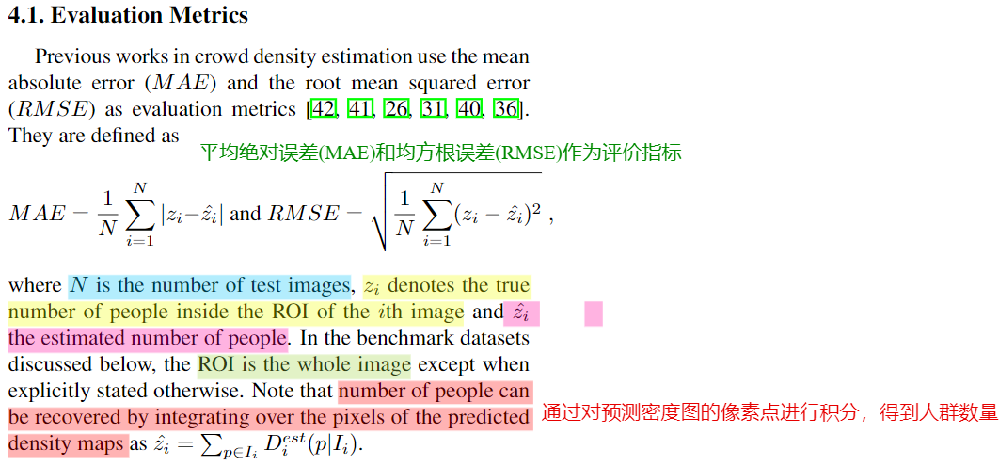

  


**The density map ：**

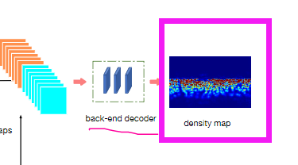

```
def estimate_density_map(img_root,gt_dmap_root,model_param_path,index):
    '''
    Show one estimated density-map.
    img_root: the root of test image data.
    gt_dmap_root: the root of test ground truth density-map data.
    model_param_path: the path of specific mcnn parameters.
    index: the order of the test image in test dataset.
    '''
    device=torch.device("cuda:0" if torch.cuda.is_available() else"cpu")
    model=CANNet().to(device)
    model.load_state_dict(torch.load(model_param_path, map_location='cpu'))
    dataset=CrowdDataset(img_root,gt_dmap_root,8,phase='test')
    dataloader=torch.utils.data.DataLoader(dataset,batch_size=1,shuffle=False)
    model.eval()
    for i,(img,gt_dmap) in enumerate(dataloader):
        if i==index:
            img=img.to(device)
            gt_dmap=gt_dmap.to(device)
            # forward propagation
            et_dmap=model(img).detach()
            et_dmap=et_dmap.squeeze(0).squeeze(0).cpu().numpy()
            print(et_dmap.shape)
            plt.imshow(et_dmap,cmap=CM.jet)
            plt.show()
            break
```

you will get：

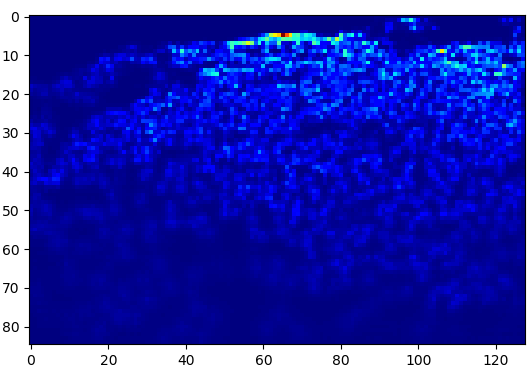


## Training

like I've already mentioned above,when you've finished the step of **def forward(self,x):**

and then followed by:

```
img=img.to(device)gt_dmap=gt_dmap.to(device)# forward propagationet_dmap=model(img)# calculate lossloss=criterion(et_dmap,gt_dmap)
```

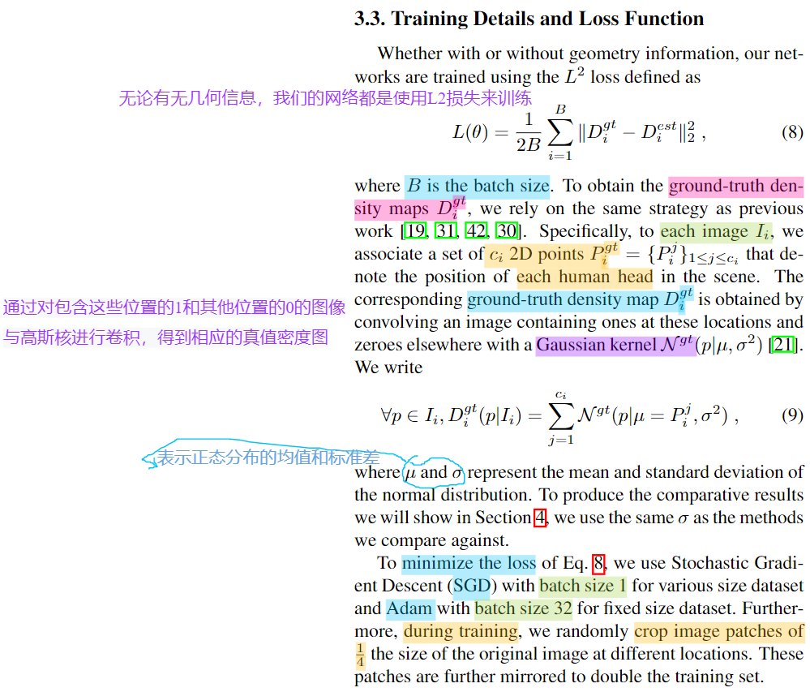


**conclusion**

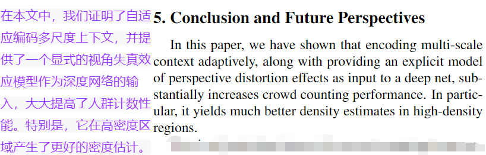

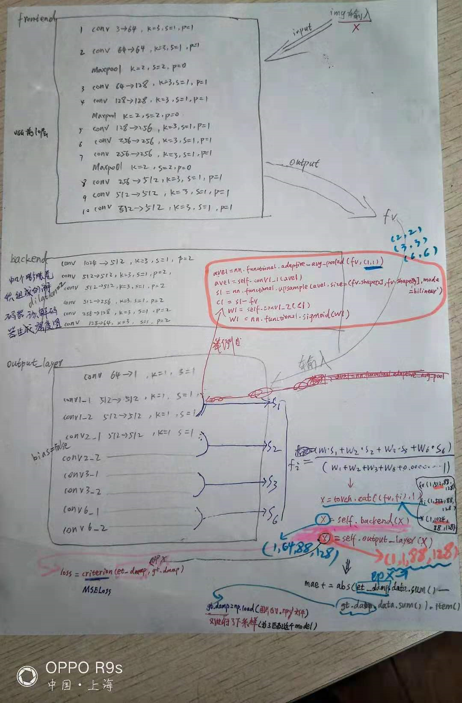